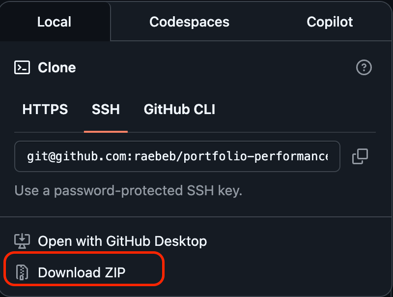
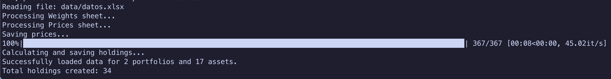
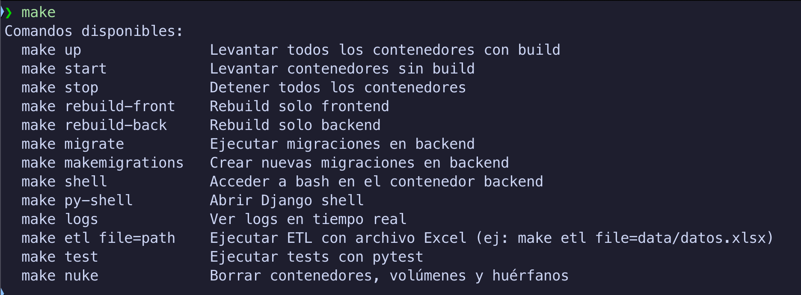
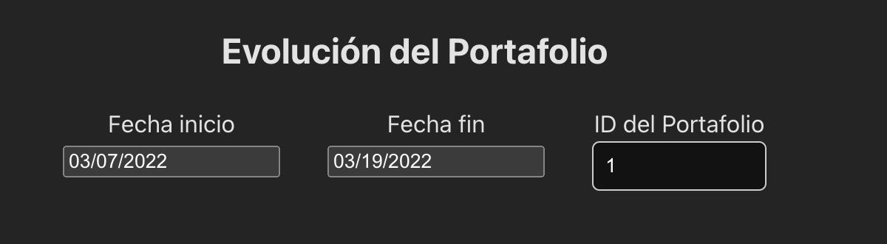
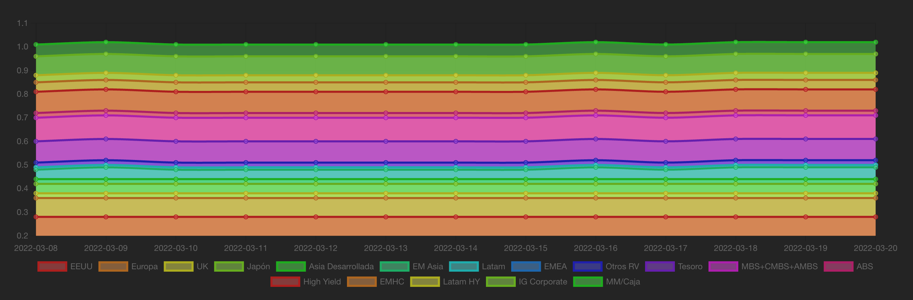
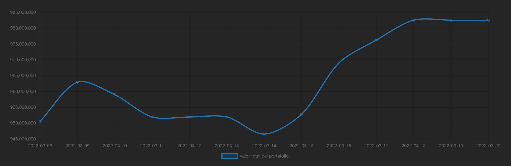

[](#)
[](#)
[](#)
[](#)
[](#)

# Prueba Técnica Abaqus

Este repositorio contiene una propuesta de solución al desafío técnico presentado por Abaqus

## Índice
1. [Comenzando 🚀](#comenzando-)
   - [Pre-requisitos 📋](#pre-requisitos-)
2. [Instalación 🔧](#instalación-)
   - [Clonar el repositorio](#1-clonar-el-repositorio)
   - [Instalar Docker](#2-descargar-e-instalar-docker)
3. [Ejecución 💻](#ejecución-)
   - [Migraciones](#migraciones)
   - [Cargar datos](#cargar-datos)
   - [Aplicación](#aplicación)
   - [Pruebas 🧪](#pruebas-)
4. [Construido con 🛠️](#construido-con-️)
5. [Trabajos futuros y posibles mejoras](#trabajos-futuros-y-posibles-mejoras)


## Comenzando 🚀
_Estas instrucciones te permitirán obtener una copia del proyecto en funcionamiento en tu máquina local para propósitos de desarrollo y pruebas._


### Pre-requisitos 📋

-   Docker

---

## Instalación 🔧

### 1. Clonar el repositorio
```
git clone git@github.com:raebeb/portfolio-performance-tracker.git
```
ó
```
git clone https://github.com/raebeb/portfolio-performance-tracker.git
```   

> Si no tienes ```git``` instalado (y no necesitas instalarlo), puedes descargar el repositorio como archivo ```.zip```.  

### 2-Descargar e instalar Docker




### 2. Descarga e instala Docker
 En caso de ya contar con Docker instalado, asegúrate de que esté ejecutándose y dirigete  al paso siguiente.  
 Si no tienes Docker instalado, puedes descargarlo desde el siguiente enlace: [Docker](https://www.docker.com/get-started/). y seguir las instrucciones de instalación según tu sistema operativo.


---  

## Ejecución 💻

En la raíz del proyecto, ejecuta el siguiente comando:
```make up```  
> Este comando levantará los contenedores necesarios e instalará las dependencias dentro de ellos para que el proyecto funcione correctamente.  

Una vez que se hayan instalado todas las dependencias podemos seguir con el siguiente paso

## Migraciones
Para crear las migraciones necesarias para la base de datos, ejecuta el siguiente comando en otra terminal:  
```make migrate```

## Cargar datos
Para cargar los datos de ejemplo en la base de datos, ejecuta el siguiente comando en otra terminal:  
```make etl file=<nombre_archivo>```
> donde <nombre_archivo> es el nombre del archivo que deseas cargar. Para este caso el comando a ejecutar es el siguiente
```make etl file=data/datos.xlsx```  

Si elarchivo se cargo correctamente, deberías ver un mensaje similar al siguiente:


> existen otros comandos en el makefile, en caso de ser necesario puedes verlos ejecutando el siguiente comando: ```make``` y se desplegara una lista de los comandos disponibles como la siguiente



### Aplicación
Para acceder a la aplicación, abre tu navegador y dirígete a la siguiente URL:  
```http://localhost:3000/```  
en el front podras ver dos diagramas como los mostrados en la siguiente imagenes junto con inputs para filtrar los datos por fecha y por id de portafolio.



> en caso de no ver los graficos, verifica en la terminal que los contenedores (front, backend y db) no han arrojado errores, si es asi, puedes intentar reiniciar los contenedores con el siguiente comando: ```make stop``` y luego ```make start``` para volver a levantar los contenedores  

### Pruebas 🧪
Para ejecutar los tests unitarios, ejecuta el siguiente comando en la terminal en la raíz del proyecto:

```
make test
```


***
## Construido con 🛠️
* [Python 3.11.12](https://www.python.org) - Lenguaje de programación
* [Django 5.2.4](https://www.djangoproject.com/) - Framework web
* [Docker](https://www.docker.com/) - Contenedores
* [React](https://reactjs.org/) - Librería de JavaScript para construir interfaces de usuario


## ⌨️ con ❤️ por [Francisca Osores](https://www.linkedin.com/in/francisca-osores-ortiz-152347149/) 👩‍💻

```
          ／＞　 フ
         | 　_　_| 
       ／` ミ＿xノ 
      /　　　　 |
     /　 ヽ　　 ﾉ
    │　　|　|　|
／￣|　　 |　|　|
(￣ヽ＿_  ヽ_)__)
＼二)
```

## Trabajos futuros y posibles mejoras:
- [ ] Agregar validaciones de datos al cargar archivos
- [ ] Mejorar el manejo de errores en frontend
- [ ] Agregar pruebas unitarias al frontend
- [ ] Agregar pruebas de integración
- [ ] Mejorar el nombre de algunos atributos en los modelos
- [ ] Mejorar e implementar más pruebas unitarias en el backend
- [ ] Validar el input de fechas en el frontend para evitar una fecha inicial mayor a la fecha final
- [ ] Validar el input de la id del portafolio en el frontend para evitar que se ingresen caracteres no válidos
- [ ] el front no esta tan centrado
- [ ] hacer el front responsivo


